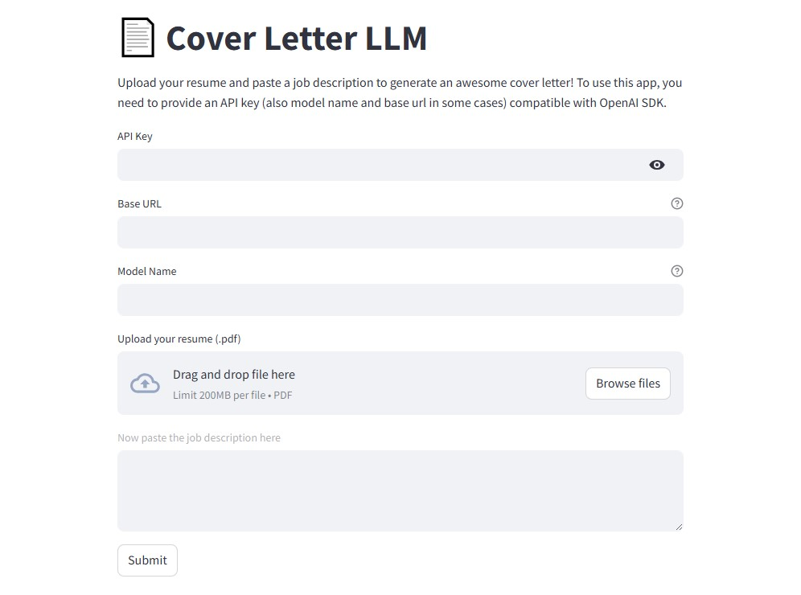

# 📄 Cover Letter LLM

A simple LLM app that generates a cover letter based on the information from an uploaded resume and a job description using any OpenAI compatible model.

Use the Web App [here](https://coverletterllm.streamlit.app/).



## Usage

### 📋 Requirements

- API key
- Base URL (for proxy or hosted models)
- Model Name

1. Go to [https://coverletterllm.streamlit.app](https://coverletterllm.streamlit.app/)
2. Enter API key, Base URL and Model Name of your any OpenAI compatible model
3. Upload a PDF File of your resume
4. Paste a job description on the text field
5. Click `Submit` button to generate the cover letter

## How to run it on your own machine

1. Clone the repository

   ```
   $ git clone https://github.com/amiorhmn/Cover-Letter-LLM.git
   $ cd Cover-Letter-LLM
   ```

2. Create and activate a virtual environment
   
   ```
   $ python -m venv .venv
   $ source .venv/bin/activate  # On Windows, use `.venv\Scripts\activate`
   ```

3. Install the requirements

   ```
   $ pip install -r requirements.txt
   ```

4. Run the app

   ```
   $ streamlit run streamlit_app.py
   ```
